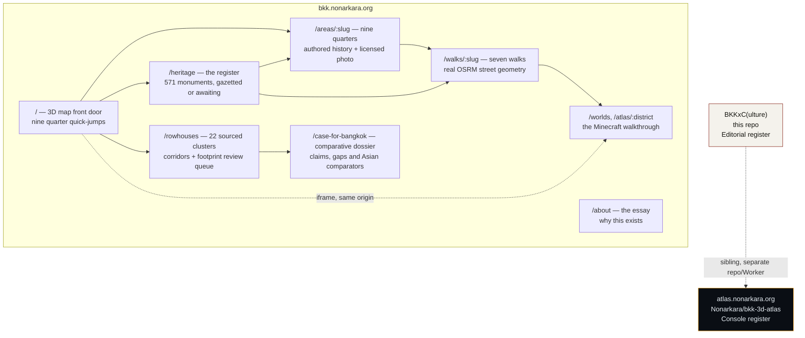

# BKKx — two systems, one city


**[bkk.nonarkara.org](https://bkk.nonarkara.org)** — **BKKxC(ulture)**, this repo. A cultural heritage system for
Bangkok: the Fine Arts Department's own register of 571 protected monuments, mapped honestly; nine heritage
quarters with authored histories and a licensed photo each; a sourced atlas of 22 rowhouse clusters, their
cultural corridors and an opt-in building-footprint review queue; seven walking routes with real street-following
geometry and Minecraft coordinates where a monument falls inside a generated world; an English/Thai toggle
across all of it; and a personal essay on why the project exists at all. The 3D map is the front door — pick a
quarter, fly there, drill into the register.


**[atlas.nonarkara.org](https://atlas.nonarkara.org)** — the sibling system, a separate repo
([`Nonarkara/bkk-3d-atlas`](https://github.com/Nonarkara/bkk-3d-atlas)), a separate Cloudflare Worker, a separate
visual register (Console: dark, one amber, built for an operator). It's Bangkok's operational digital twin — live
traffic, air quality, heat, rain radar, flooding, CCTV, land price, breaking-news incidents — 432,077 OSM
buildings rendered in 3D over real-time civic data. **Not this repository.** It's linked here because the two
grew out of the same original idea and still share a design lineage, not because touching one touches the other.

The two used to collide: an earlier version of `edge-proxy/` claimed *both* domains and silently redirected
`bkk.nonarkara.org` to the atlas. That's fixed — `edge-proxy/` in this repo now claims only `bkk.nonarkara.org`,
full stop. See `context.md` for the incident and the permanent guard against it recurring.

## What's in BKKxC(ulture)



**The register.** Not the dataset most people reach for first — [`vw_important_architecture`](https://data.go.th/dataset/vw_important_architecture)
(Ministry of Culture) covers 72 provinces and has zero Bangkok records. This uses the [Fine Arts Department
register](https://data.go.th/dataset/gis-finearts) instead: 8,341 monuments nationwide, 571 in Bangkok. 397 of
those publish coordinates to two decimal places (~1.1 km) — in the Historic Core, 181 monuments collapse onto 12
points, 37 stacked on one. `scripts/build-heritage-register.py` resolves each row against the register, then
OpenStreetMap by name, then leaves it unpinned rather than guessing — every site records which method won.

**Nine quarters, seven walks.** Rattanakosin, Kudi Chin, Talad Noi, Song Wat, Yaowarat & Sampheng, Sam Phraeng,
Nang Loeng, Charoen Krung, Bang Krachao — each an authored page, not a database dump. The seven walks carry real
walking distances and times from OSRM's foot profile (not straight-line estimates), a "by the numbers" block per
walk (gazetted/awaiting split, oldest gazette entry and its age, walking pace), and — for the 125 stops that fall
inside a generated Minecraft world — the exact `/tp` command to stand on them.

**The rowhouse atlas.** `/rowhouses` documents 32 ensembles across royal frontages, market rows, commercial
streets, canal markets and community-led conservation. Each record carries its source, explorer note, geometry
method and confidence. The same data appears as clickable corridors in the 3D map and as an open
[`GeoJSON download`](https://bkk.nonarkara.org/data/bangkok-rowhouse-atlas.geojson). Solid map lines follow
high-confidence street axes or documented extents; dashed lines are interpretive. They are cultural corridors,
not cadastral parcels or legal conservation boundaries. A second, opt-in
[`candidate-footprint download`](https://bkk.nonarkara.org/data/bangkok-rowhouse-footprint-candidates.geojson)
screens current Overture building shapes for field review. It explicitly does **not** confirm rowhouses, age or
heritage status. The directory also crosswalks all 46 category-E records in ONEP's Rattanakosin conservation
survey: 26 are linked to mapped corridors and 20 remain visibly queued. See
[`docs/rowhouse-atlas-method.md`](docs/rowhouse-atlas-method.md) for the reproducible method.

**Heritage-specific 3D.** The Historic Core does not stop at the operational twin's generic building tiles.
`bkk-heritage-detail.geojson` keeps 9,275 full-resolution Old Town footprints; `bkk-landmarks.geojson` supplies
73 curated massing parts; and `bkk-hero-monuments.geojson` now carries 67 higher-detail parts across Wat Arun,
Phra Siratana Chedi, Phra Mondop, Prasat Phra Dhepbidorn and Wat Pho's Four Great Chedis. Wat Arun's central 82 m envelope comes from a Fine
Arts Department publication and its footprint from a checked-in OSM way snapshot. The three Wat Phra Kaew
structures are matched to the Bureau of the Royal Household's official plan; Phra Mondop's seven roof tiers are
also documented by Fine Arts. Wat Pho and Fine Arts sources establish the four-chedi group and royal chronology;
their 40 m silhouettes and tiering remain explicitly interpretive. Heights without an official dimension remain labelled interpretive.
`npm run data:heroes` rebuilds the transparent output and the release tests enforce the evidence and caveats.

**The Bangkok case.** `/case-for-bangkok` compares the emerging evidence with UNESCO's own descriptions of
George Town and Melaka, Vigan, Hoi An, Luang Prabang and Galle. It is deliberately a claim register, not a
campaign slogan: what is already supported, what is promising, and what cannot be claimed until Bangkok has a
building-level inventory, defensible boundary, integrity assessment and management system.

**Bilingual.** Every quarter, every walk, and the essay toggle between English and Thai. The long-form content was
translated by seven parallel agent passes, each given the exact source text and told to translate naturally
rather than word-for-word while preserving every fact, name and date; UI chrome is a small hand-written
dictionary. The register's own raw government prose (571 monuments' worth) stays untranslated — that volume was
out of scope for this pass, and the site says so rather than leaving a silent gap.

**The essay.** `/about` — why the project exists, in Dr Non's own first-person voice: born in Bangkok, grew up in
its old town, collects World Heritage cities, and has concluded the best one he's found is the one closest to
home that never got the UNESCO plaque.

**The Minecraft worlds.** Where this started. Two districts generated block-by-block from OpenStreetMap, Overture
Maps and land-cover data, playable in Minecraft Java Edition, with a browser-based 3D walkthrough at
`/atlas/:district`.

| World | Coverage | Size | Validated chunks |
| --- | --- | ---: | ---: |
| Ratchathewi / ราชเทวี | Victory Monument, Phaya Thai, Pratunam and Makkasan | 4.96 × 2.95 km | 61,440 |
| Historic Core / เกาะรัตนโกสินทร์ | Phra Nakhon, Chao Phraya and adjacent Thonburi | 3.38 × 3.22 km | 50,176 |

Both worlds use a 1 block = 1 metre local projection and open in Creative mode on Minecraft Java Edition 1.21.4+.

## Download and enter Bangkok

```bash
./scripts/install-macos.sh ratchathewi
./scripts/install-macos.sh historic-core
```

The installer uses a local generated world when present; otherwise it downloads the matching
[GitHub Release](https://github.com/Nonarkara/BKKx/releases/latest), and never overwrites an existing save.

## Repository map

```text
site/       the Next.js/vinext app — everything at bkk.nonarkara.org
edge-proxy/ custom-domain binding for bkk.nonarkara.org ONLY (see context.md)
scripts/    build-heritage-register.py, build-heritage-places.py, fetch-heritage-photos.py,
            export-rowhouse-data.mjs, plus the Minecraft installer and Anvil integrity validator
worlds/     generation manifests + tiny level.dat spawn headers (not the world binaries)
public/     banners/, photos/ — source assets for docs and the About essay
previews/   validated top-down world maps
releases/   archive checksums; binary worlds are attached to GitHub Releases
context.md  the fuller version of everything in this README, plus deploy gotchas
```

A dedicated, independently-buildable snapshot of the culture site's source also lives at
[`Nonarkara/BKKxCulture`](https://github.com/Nonarkara/BKKxCulture) — see that repo's README for its exact
relationship to this one (short version: this repo is still the live deploy source; that one exists so the
Culture site has a focused home to eventually migrate to).

## Run it locally

```bash
cd site
npm install
npm run dev
```

Production checks:

```bash
npm run build
npx tsc --noEmit
npm run lint
node --test tests/rendered-html.test.mjs
```

The site uses vinext/React and deploys as a Cloudflare Worker (`bkkx-site`), fronted by `edge-proxy/` on
`bkk.nonarkara.org`. A small D1 table records aggregate pageviews without storing IP addresses. World binaries
stay outside the website bundle and are distributed through GitHub Releases.

## Rebuild the heritage data

```bash
python3 scripts/build-heritage-register.py            # the 571-monument register
python3 scripts/build-heritage-places.py               # 9 quarters + 7 walks + real route legs
python3 scripts/fetch-heritage-photos.py                # Commons photos, machine-checked to free licences
cd site && npm run data:rowhouses                      # 22 points + 22 corridors as public GeoJSON
cd site && npm run data:rowhouse-footprints            # current Overture shapes, scored for human review
```

Source pulls cache in `.cache/` (gitignored); `--refresh`/`--reroute`/`--refetch` re-fetch. Photos: Wikimedia
Commons only, PD/CC0/CC-BY/CC-BY-SA, one photo per slot, full attribution on every page that uses one.

## Generate another Bangkok district

Worlds are generated with [Arnis](https://github.com/louis-e/arnis) from OpenStreetMap, Overture Maps and
land-cover data. Record the exact bounding box, scale, generator version and validation results in a
`bkkx-manifest.json`, then add the district to `site/app/walkthrough-data.ts`.

```bash
python3 scripts/validate_world.py /path/to/generated-world
```

These are procedurally generated city-scale models, not survey-grade engineering twins. Building footprints,
inferred heights, roads, water, vegetation and selected 3D assets depend on source-map coverage.

## Roadmap

- Translate the register's own raw Fine Arts Department text (571 monuments) for full EN/TH parity.
- Field-verify the footprint review queue, then add frontage, age, condition, use and archival-photo evidence.
- Add the remaining Bangkok districts as independent world chapters.
- Layer live civic data onto the heritage quarters — that's what the sibling atlas project already does city-wide.
- Add community-submitted stories and landmark corrections.
- Migrate the live deploy source to `Nonarkara/BKKxCulture` once it's earned that role.

Contributions and district requests are welcome through [GitHub Issues](https://github.com/Nonarkara/BKKx/issues).
See [CONTRIBUTING.md](CONTRIBUTING.md) for the minimum handoff.

## Attribution and license

Code: MIT License (see [LICENSE](LICENSE)). Geographic data: © OpenStreetMap contributors, ODbL 1.0; supplemental
building data may include Overture Maps. Register data: Fine Arts Department, Creative Commons Attribution.
Photos: Wikimedia Commons, individually licensed and attributed per-page — see `site/public/heritage/photos.json`
for the register and `site/public/about/` for the essay. Arnis is Apache-2.0 licensed. Generated world
distributions retain their source-data attribution in each manifest and in [NOTICE.md](NOTICE.md).
