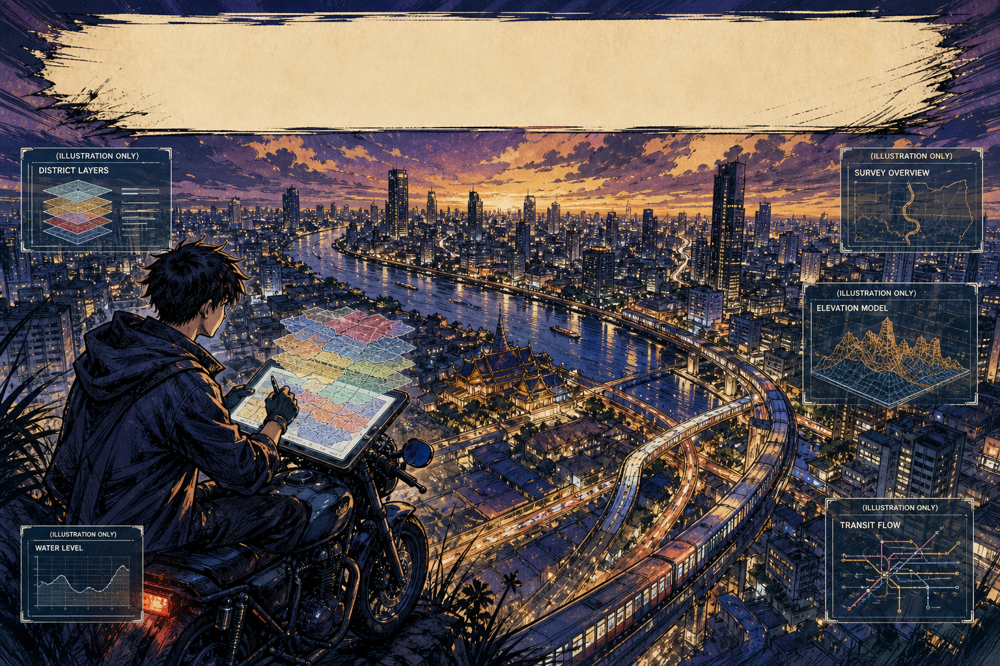
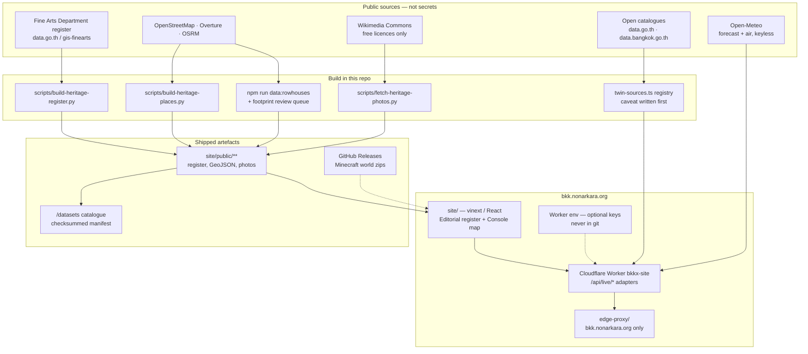

<p align="center">
  
</p>

<p align="center"><em>City layers over Bangkok — a civic atlas, not a sealed console.<br />
The HUD panels in this banner (district layers, water level, survey overview, elevation model, transit flow) are <strong>illustration only</strong>. They are concept artwork, not the running UI.</em></p>

# BKKx

**[bkk.nonarkara.org](https://bkk.nonarkara.org)** is an open civic atlas of Bangkok: the Fine Arts Department register of 571 ancient monuments, nine authored heritage quarters, seven street-following walks, a sourced rowhouse atlas, bilingual English/Thai reading, and two Minecraft Java worlds generated at 1 block = 1 metre. The 3D map is the front door.

A sibling operational twin lives at **[atlas.nonarkara.org](https://atlas.nonarkara.org)** in a separate repository ([`Nonarkara/bkk-3d-atlas`](https://github.com/Nonarkara/bkk-3d-atlas)). Same city, different job. This repository does not deploy that site.

---

## 1. What this is

BKKx is a **civic atlas**: a public, inspectable picture of Bangkok in layers — heritage, ordinary fabric, water, and the method used to assemble them. It is a studio instrument for reading the city, not a municipal product and not a live operations console.

What ships here, at [bkk.nonarkara.org](https://bkk.nonarkara.org):

| Surface | What you actually get |
| --- | --- |
| `/` | 3D heritage front door — nine quarter jumps into the Historic Core map |
| `/heritage` | Fine Arts Department register, 571 Bangkok monuments, mapped honestly |
| `/areas/:slug` | Nine authored quarters with a licensed Commons photo each |
| `/walks/:slug` | Seven walks on real OSRM foot geometry, not straight-line guesses |
| `/rowhouses` | 32 sourced ensembles: cultural corridors + an opt-in footprint review queue |
| `/shophouses` | Research companion: pressure map, gazetteer, comparative essay |
| `/datasets` | Open-data catalogue — every served file, sourced, licensed, checksummed |
| `/warroom` | Counted corpus plus live adapters that fail in public rather than invent a zero |
| `/about` | Why the project exists |
| `/case-for-bangkok` | Comparative dossier against Asian heritage cities — claims, gaps, not a slogan |
| `/worlds`, `/atlas/:district` | Minecraft walkthrough of two generated districts |

**The register.** Not the dataset most people reach for first — [`vw_important_architecture`](https://data.go.th/dataset/vw_important_architecture) (Ministry of Culture) covers 72 provinces and has **zero Bangkok records**. This uses the [Fine Arts Department register](https://data.go.th/dataset/gis-finearts) instead: 8,341 monuments nationwide, 571 in Bangkok. 397 of those publish coordinates to two decimal places (~1.1 km) — in the Historic Core, 181 monuments collapse onto 12 points, 37 stacked on one. `scripts/build-heritage-register.py` resolves each row against the register, then OpenStreetMap by name, then leaves it unpinned rather than guessing. Every site records which method won.

**Nine quarters, seven walks.** Rattanakosin, Kudi Chin, Talad Noi, Song Wat, Yaowarat & Sampheng, Sam Phraeng, Nang Loeng, Charoen Krung, Bang Krachao — each an authored page, not a database dump. The walks carry OSRM foot-profile distances and times, and — for the 125 stops that fall inside a generated Minecraft world — the exact `/tp` command to stand on them.

**The rowhouse atlas.** Cultural corridors, not cadastral parcels. Each record carries its source, geometry method and confidence. Solid map lines follow high-confidence street axes or documented extents; dashed lines are interpretive. A second, opt-in [candidate-footprint download](https://bkk.nonarkara.org/data/bangkok-rowhouse-footprint-candidates.geojson) screens current Overture building shapes for field review. It does **not** confirm rowhouses, age or heritage status. Method: [`docs/rowhouse-atlas-method.md`](docs/rowhouse-atlas-method.md).

**Bilingual.** Quarters, walks and the essay toggle English/Thai. The register's own raw government prose stays untranslated — that volume was out of scope, and the site says so rather than leaving a silent gap.

**The Minecraft worlds.** Where this started. Two districts generated block-by-block from OpenStreetMap, Overture Maps and land-cover data, playable in Minecraft Java Edition 1.21.4+.

| World | Coverage | Size | Validated chunks |
| --- | --- | ---: | ---: |
| Ratchathewi / ราชเทวี | Victory Monument, Phaya Thai, Pratunam and Makkasan | 4.96 × 2.95 km | 61,440 |
| Historic Core / เกาะรัตนโกสินทร์ | Phra Nakhon, Chao Phraya and adjacent Thonburi | 3.38 × 3.22 km | 50,176 |

Both use a 1 block = 1 metre local projection and open in Creative mode.

**The sibling system.** [`Nonarkara/bkk-3d-atlas`](https://github.com/Nonarkara/bkk-3d-atlas) is Bangkok's operational digital twin — live traffic, air, heat, rain, flooding, CCTV, land price — on its own Worker and its own domain. `edge-proxy/` in **this** repo binds `bkk.nonarkara.org` only. See `context.md` for the incident that made that rule load-bearing.

A focused snapshot of the culture site also lives at [`Nonarkara/BKKxCulture`](https://github.com/Nonarkara/BKKxCulture). This repo remains the live deploy source.

---

## 2. Philosophy / invitation

Bangkok is a living city that never got the UNESCO plaque. That is not an oversight this project exists to correct. A civic atlas is the other kind of plaque: a public instrument that admits, layer by layer, what is known, what is hoped for, and what must not be claimed yet.

The layers in the banner — districts, water, survey, elevation, transit — are the *idea* of that instrument. The software in this repository is the slower, sourced version: every number has a generator, every gap has a sentence, every live feed is allowed to say it is down.

**Fork the method, not the secrets.**

The portable part is written down in [`docs/twin-data-sources.md`](docs/twin-data-sources.md) and in [`site/app/data/twin-sources.ts`](site/app/data/twin-sources.ts):

1. **A registry before a dashboard.** Each candidate source names what it unlocks, its licence, whether a browser can reach it, and — written *before* integration — the caveat that will bite.
2. **An envelope that never invents a reading.** `{ ok, fetchedAt, source, data?, reason? }`. An unreachable gauge and a city with no rain are opposite facts. A zero is not a polite failure.
3. **Transport decides architecture, not preference.** HTTPS plus CORS can reach the browser; everything else is proxied. Being able to fetch directly is not a reason to — Open-Meteo is keyless and CORS-open, and this project still proxies it so visitors do not hand their IP to a third party.
4. **A key in a repository is a leak**, including in a private one. Credentials, if an agency ever grants them, live in Worker environment variables at request time. They are not in git, not in this README, and not in error strings.

Take the pattern to another city. Swap the rows, keep the fields. Re-check licences for *your* deployment. Do not copy unpublished operational feeds, agency passwords, or anyone else's keys. The invitation is the method.

The fuller argument, in the first person, is at [`/about`](https://bkk.nonarkara.org/about).

---

## 3. Ethical use

BKKx is an independent civic project. **It is not an official product of the Bangkok Metropolitan Administration (BMA), the Fine Arts Department, ONEP, or any other Thai government agency**, unless a document committed in this repository expressly says so. Open data reused here remains those agencies' data; this studio's curation does not confer official status.

When you reuse this work:

- **Attribute.** Code is MIT (see [§6](#6-license)). Geographic data, the register, photos and generated worlds keep their own licences — OpenStreetMap (ODbL), Overture, Fine Arts Department (CC BY), Wikimedia Commons per-file, Arnis (Apache-2.0). See [NOTICE.md](NOTICE.md).
- **Do not treat layers as law.** Rowhouse corridors are cultural extents, not parcels, conservation boundaries or height-control lines. Candidate footprints are a review queue, not confirmed heritage. Generated Minecraft worlds are city-scale models, not survey-grade twins. Zoning sketches in the atlas are orientation only.
- **Do not use this map for regulation, demolition, valuation, ownership or emergency dispatch.**
- **Do not invent feeds to make a demo look alive.** A fabricated camera URL or a guessed rainfall zero is worse than an empty panel that explains itself.
- **Do not commit secrets.** Optional Worker bindings (`FIRMS_MAP_KEY`, `LONGDO_API_KEY`, `CCTV_SOURCE_URL`) are environment slots, not values. Some civic endpoints that used to answer without credentials no longer do; this project records that as unavailable rather than storing a password. Forks must obtain their own authorised access.

Photos are Wikimedia Commons only (PD / CC0 / CC-BY / CC-BY-SA), one per slot, with attribution on every page that uses one. See `site/public/heritage/photos.json`.

---

## 4. How the system works

Public catalogues in, sourced files out, a Worker that may proxy live feeds but never ships their keys.



**Editorial frames, Console focus.** The heritage shell is paper, Sao Chingcha, one oxide accent (`#8c2f23`) meaning *gazetted*. The 3D map and war room are dark Console surfaces. The homepage iframes `/atlas/historic-core?embed=1` on **this** origin — never `atlas.nonarkara.org`. Pointing that iframe at the sibling domain is what made the two sites collide; keep it relative.

**Live adapters.** `/api/live/rain`, `/weather`, `/fires`, `/cctv`, `/longdo/*` run on the Worker. Open-Meteo forecast and air quality are wired today. NASA FIRMS, Longdo and a camera registry are ready behind optional env vars. BMA drainage observation is catalogued as researched: the public gauge route now requires credentials, so the adapter reports that fact instead of drawing zero millimetres. The contract is in [`site/worker/live.ts`](site/worker/live.ts).

**A small D1 table** records aggregate pageviews (path, referrer, country, language, timestamp). No IP addresses, no user-agents, no credentials.

---

## 5. How to run / fork from what is actually in the repo

### Repository map

```text
site/         vinext app — everything at bkk.nonarkara.org
edge-proxy/   custom-domain binding for bkk.nonarkara.org ONLY
scripts/      register, places, photos, world installer, Anvil validator
worlds/       generation manifests + tiny level.dat headers (not the binaries)
docs/         method notes + this README's hero banner
public/       source assets for docs and the About essay
previews/     validated top-down world maps
releases/     archive checksums; world zips are GitHub Release assets
context.md    deploy history and the domain-collision guard
```

World binaries stay out of git and out of the website bundle.

### Run the site

Requires Node.js `>= 22.13.0`.

```bash
cd site
npm install
npm run dev
```

Production checks (from `site/`):

```bash
npm run build
npx tsc --noEmit
npm run lint
node --test tests/rendered-html.test.mjs
```

The site deploys as Cloudflare Worker `bkkx-site`, fronted by `edge-proxy/` on `bkk.nonarkara.org`. Forks will need their own Cloudflare account, D1 binding and domain — none of those credentials are in this repository.

Optional live layers, if you have your **own** authorised keys, are Worker secrets named in [`site/worker/index.ts`](site/worker/index.ts). Leave them unset and the panels explain themselves.

### Rebuild the heritage data

```bash
python3 scripts/build-heritage-register.py   # 571-monument register
python3 scripts/build-heritage-places.py      # 9 quarters + 7 walks + OSRM legs
python3 scripts/fetch-heritage-photos.py       # Commons, free licences, one photo per slot
cd site && npm run data:rowhouses             # public GeoJSON
cd site && npm run data:rowhouse-footprints   # Overture shapes, scored for human review
```

Source pulls cache in `.cache/` (gitignored). `--refresh` / `--reroute` / `--refetch` re-fetch. Nothing here calls a private BMA operations API.

### Download and enter the Minecraft worlds

macOS installer (uses a local generated world when present; otherwise the matching [GitHub Release](https://github.com/Nonarkara/BKKx/releases/latest); never overwrites an existing save):

```bash
./scripts/install-macos.sh ratchathewi
./scripts/install-macos.sh historic-core
```

### Generate another Bangkok district

Worlds are generated with [Arnis](https://github.com/louis-e/arnis) from OpenStreetMap, Overture Maps and land-cover data. Record the bounding box, scale, generator version and validation results in a `bkkx-manifest.json`, then add the district to `site/app/walkthrough-data.ts`.

```bash
python3 scripts/validate_world.py /path/to/generated-world
```

These are procedurally generated city-scale models, not survey-grade engineering twins.

### Fork the method into another city

1. Copy [`site/app/data/twin-sources.ts`](site/app/data/twin-sources.ts); replace the rows, keep `caveat` and `integration`.
2. Copy the live envelope and one adapter from [`site/worker/live.ts`](site/worker/live.ts).
3. Point heritage ingest at *your* open register, not Bangkok's Fine Arts extract.
4. Re-read licences. NC terms (for example FABDEM) and agency camera terms do not travel just because the code does.
5. Do not paste another city's operational URLs, keys or passwords into the fork. Obtain access in the open, or leave the panel dark.

Contributions and district requests: [GitHub Issues](https://github.com/Nonarkara/BKKx/issues). Minimum handoff: [CONTRIBUTING.md](CONTRIBUTING.md).

---

## 6. License

Code: **MIT License** (see [LICENSE](LICENSE)). Copyright (c) 2026 Non Arkara.

Geographic data: © OpenStreetMap contributors, ODbL 1.0; supplemental building data may include Overture Maps. Register data: Fine Arts Department, Creative Commons Attribution. Photos: Wikimedia Commons, individually licensed and attributed per-page. Arnis is Apache-2.0. Generated world distributions retain their source-data attribution in each manifest and in [NOTICE.md](NOTICE.md).

Minecraft is a trademark of Microsoft/Mojang. BKKx is an independent open-source project and is not affiliated with or endorsed by Microsoft, Mojang, or the Bangkok Metropolitan Administration.
